# Drafto - Notes, To-dos & Bookmarks

A clean and simple Android app to take notes, organize to-dos, and save web bookmarks all in one place. Built with Kotlin and Jetpack Compose, designed to be fast, minimal with 100% privacy.

[](https://github.com/Ixeken-Studios/drafto-app/releases/latest)

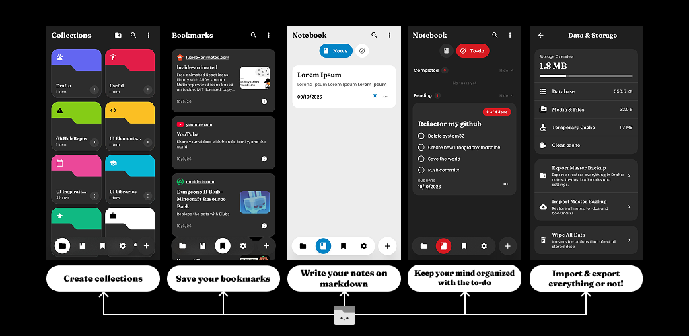


## Key Features

### Markdown Notes
- Write distraction-free notes with full Markdown formatting (headings, lists, bold, italics, code blocks, and quotes).
- Instant preview mode to see how your note looks while you write.
- Export notes directly to standard `.md` files.

### To-dos & Checklists
- Create simple tasks and checklists with subtasks.
- Track your progress with clear visual completion counters.
- Set due dates and easily filter between pending and finished tasks.

### Web Bookmarks
- Save links quickly from your clipboard or via the Android share menu.
- Automatically fetches website titles, descriptions, and icons for clean preview cards.
- Import and export your bookmarks using standard HTML (compatible with Chrome, Firefox, Safari) or JSON.

### Collections
- Keep your notes, to-dos, and bookmarks organized together in custom folders.
- Personalize each collection with its own color and icon.
- Filter content quickly to find what you need without clutter.

### Live Notes
- Pin a quick temporary note directly into your Android status bar.
- See a countdown timer so you don't forget urgent reminders.
- Extend time, edit, or mark as done straight from your notifications.

### Clean Theming
- Choose between 4 themes: Dark, Light, AMOLED black, and warm Kraft paper.
- Customize your accent color with multiple color options.
- Adjust text size and reduce animations for smooth performance on any phone.

### 100% Private
- **Zero data collection:** No accounts, no cloud sync, no tracking, and no ads. Everything stays strictly on your phone.
- Lock the app with fingerprint, face unlock, or your phone's PIN.
- Create full `.zip` backups of all your notes, tasks, bookmarks, and media whenever you want.

## Screenshots

<p align="center">
  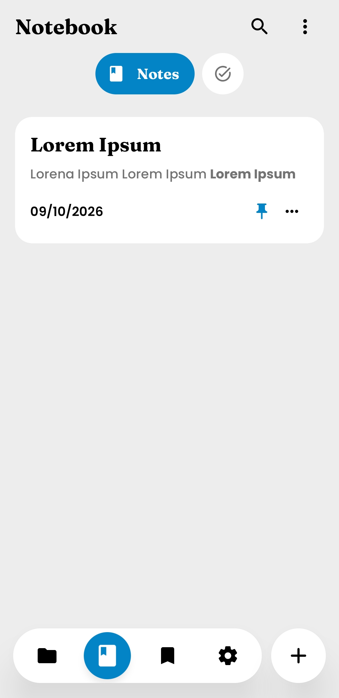&nbsp;
  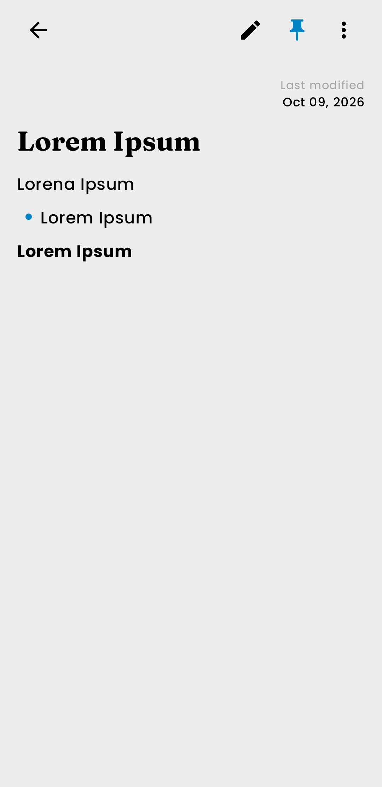&nbsp;
  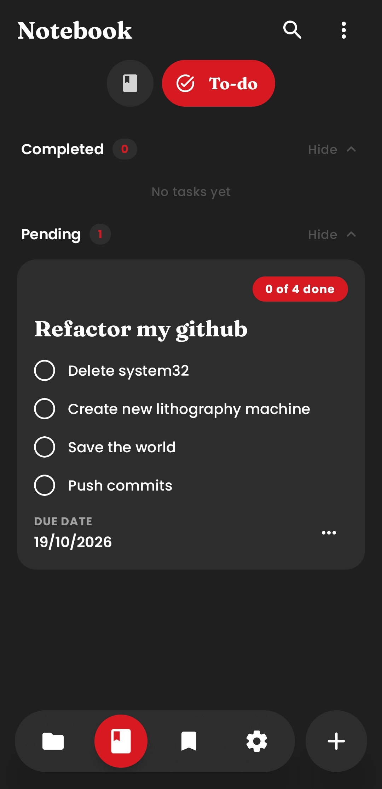&nbsp;
  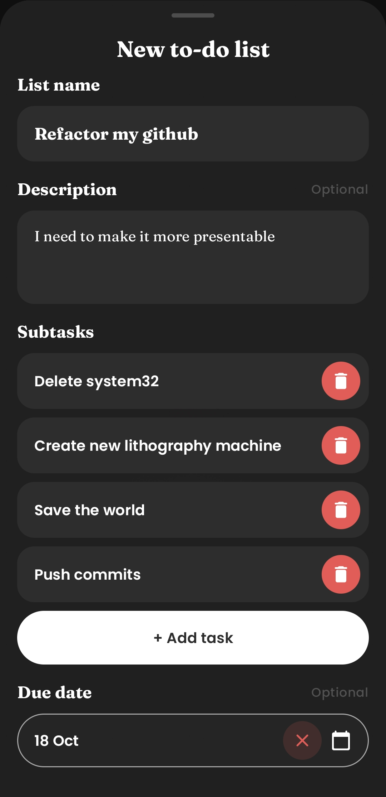&nbsp;
  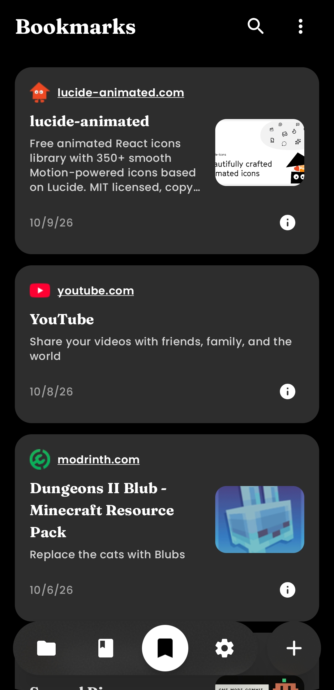
</p>
<p align="center">
  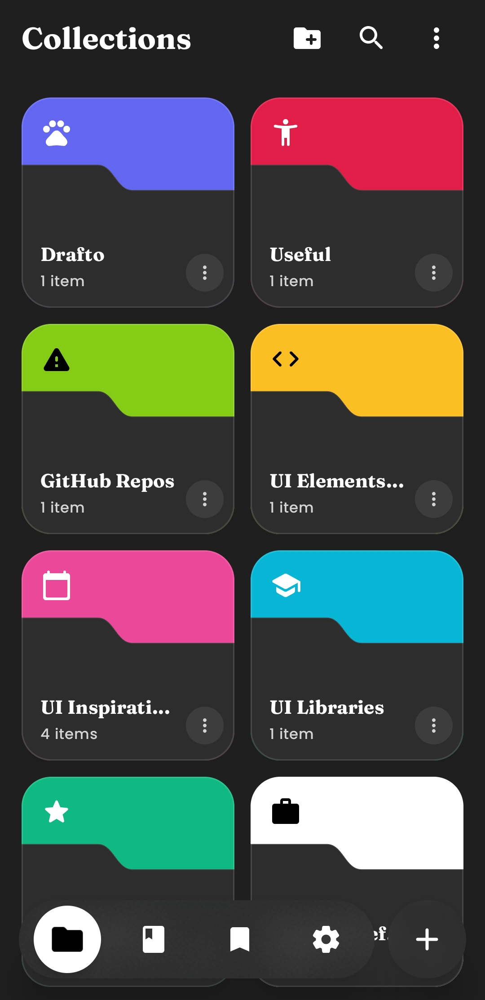&nbsp;
  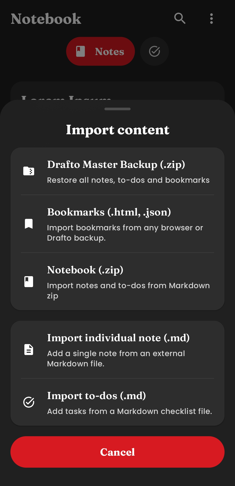&nbsp;
  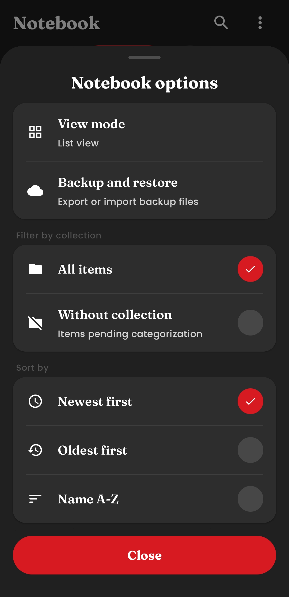&nbsp;
  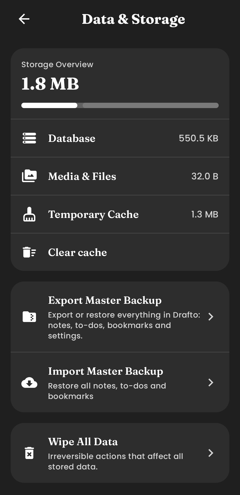&nbsp;
  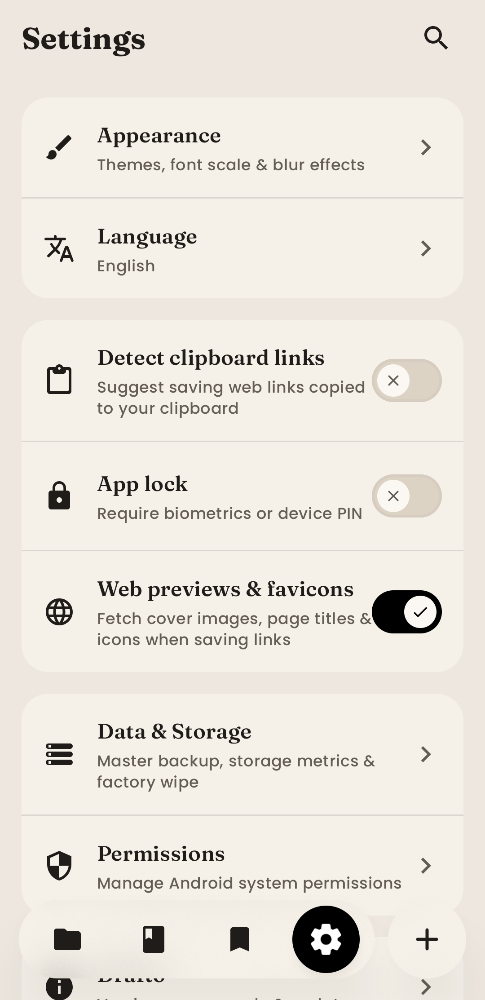
</p>

## Tech Stack

| Layer | Technology |
|---|---|
| Language | Kotlin 2.2.10 |
| UI Toolkit | Jetpack Compose (BOM 2026.09.00), Material 3, Material Icons Extended |
| UI Blur & Transitions | Haze 2.0 (`dev.chrisbanes.haze`) |
| Architecture | Multi-Module Gradle (`:app`, `:core`, `:features`), MVI / MVVM, Clean Architecture |
| Dependency Injection | Dagger Hilt 2.60.1 |
| Local Database | Room 2.8.5 with KSP 2.2.10-2.0.2 |
| Preferences | Jetpack DataStore Preferences 1.2.1 |
| Background Work | Android WorkManager 2.11.2 |
| Media & Images | Coil 2.7.0 (Compose, SVG, Video) & Media3 ExoPlayer 1.11.1 |
| Text & Markdown | `compose-markdown` 0.7.2, Google Fonts (Fraunces, Plus Jakarta Sans) |
| Security | AndroidX Biometric 1.2.0 |
| Build System | Android Gradle Plugin 9.3.1, Gradle 9.5, Version Catalogs (`libs.versions.toml`) |

<p align="center">
  &nbsp;&nbsp;
  &nbsp;&nbsp;
  &nbsp;&nbsp;
</p>

## Requirements

To build and run Drafto locally, make sure you have:
- **Android Studio Ladybug** (2024.2.1) or newer (or Antigravity IDE / VS Code with Android CLI).
- **JDK 17** or newer (Android Studio comes with an embedded JetBrains Runtime JBR which is fully compatible).
- **Android SDK Platform 37** installed via Android Studio SDK Manager (minSdk 34, compileSdk 37).
- **Physical Device or Emulator** running Android 14 (API 34) or higher.

## Getting Started

### 1. Clone the repository
```bash
git clone https://github.com/Ixeken-Studios/drafto-app.git
cd drafto-app
```

### 2. Build the application

- **Debug Build (Recommended for testing):**
  - *Linux/macOS:* `./gradlew assembleDebug`
  - *Windows:* `.\gradlew.bat assembleDebug`

- **Release Build (Requires local signing configuration in `local.properties`):**
  - *Linux/macOS:* `./gradlew assembleRelease --no-configuration-cache`
  - *Windows:* `.\gradlew.bat assembleRelease --no-configuration-cache`

The compiled APKs will be located in: `app/build/outputs/apk/`

## Acknowledgements

- **[Haze](https://github.com/chrisbanes/haze)** - For backdrop blur capabilities in Jetpack Compose.
- **[Coil](https://coil-kt.github.io/coil/)** - For asynchronous image, SVG, and video thumbnail loading in Jetpack Compose.
- **[jeziellago/compose-markdown](https://github.com/jeziellago/compose-markdown)** - For rich Markdown parsing and rendering in Compose.

## License
<p align="center">
  
</p>
This project is licensed under the MIT License - see the LICENSE file for details.
